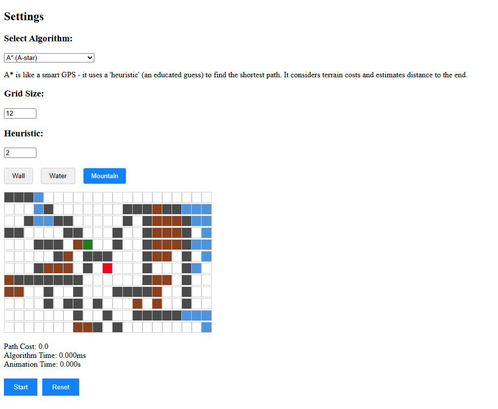
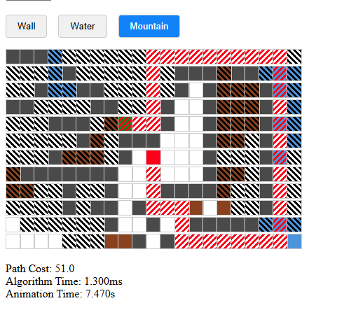

# Pathfinding Algorithm Visualizer

This is a 24-hour hackathon entry. A web project that creates a 2D drawable grid and uses the option of 4 different pathfinding algorithms to animate how the algorithm "thinks"

## Table of Contents

- [Tech Stack](#tech-stack)
- [Preview](#preview)
- [Installation](#installation)
- [Usage](#usage)
- [License](#license)
- [Contact](#contact)

## Tech Stack

 - **React**: Web Framework
 - **Node**: JS Environment
 - **Vite**: Build Tool
 -  **Typescript**: Type safe scripting language, logic and UI is built with this
 -  **Tailwind.css**: CSS with utility classes

## Preview

      

The drawing and animation of the grid is all based on this interface which is created in each grid cell
```typescript
export interface GridNode {
    row: number;
    col: number;
    isStart: boolean;
    isEnd: boolean;
    isWall: boolean;
    distance: number;     // How far from start (actual distance traveled)
    heuristic: number;    // Estimated distance to end (for A* algorithm)
    totalDistance: number; // distance + heuristic
    previousNode: GridNode | null;  // Which node did we come from? (for backtracking)
    isVisited: boolean;   // Has this node been visited?
    isPath: boolean;      // Is this node part of the final path?
    terrain: 'normal' | 'water' | 'mountain' | 'wall';  // What type of terrain?
    weight: number;       // How "costly" to move through this cell
} 
```

## Installation

Clone Repository
```bash
cd desired directory
```

```bash
git clone https://github.com/nathanialwm/PathingVisualizer.git
```

Install dependencies
```bash
npm install
```

## Usage

```bash
npm run dev
```

This will provide a webpage through localhost

## License

Unlicensed

## Contact

Nathanial Martin @ [Linkedin](https://www.linkedin.com/in/nathanialm/)
